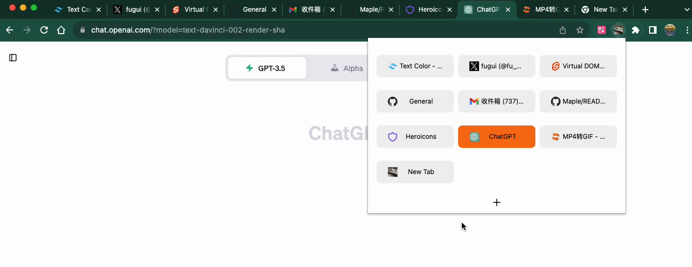

    
    <h1 align="center">灵活Tab</h1>
    
tab页开了太多？<code>灵活Tab</code> 让你使用tab更轻松

## 介绍
tab开启太多不好查找和删除，访问tab也很不方便，所以我写了一个灵活Tab扩展，只需使用快捷键 `Command + E`(Mac)

<kbd>
  
</kbd>

## 安装
可以下载 [@fugui.zip](https://github.com/fuguid/-fugui/releases/latest/download/@fugui.zip)，解压以后，参考 [Loading an unpacked extension](https://developer.chrome.com/docs/extensions/mv3/getstarted/development-basics/#load-unpacked) 来使用本地包

## 实践
1.使用 Command + E(Mac)、Ctrl+Shift+B(Windows)点击扩展图标

2.将 @fugui 固定到工具栏上
